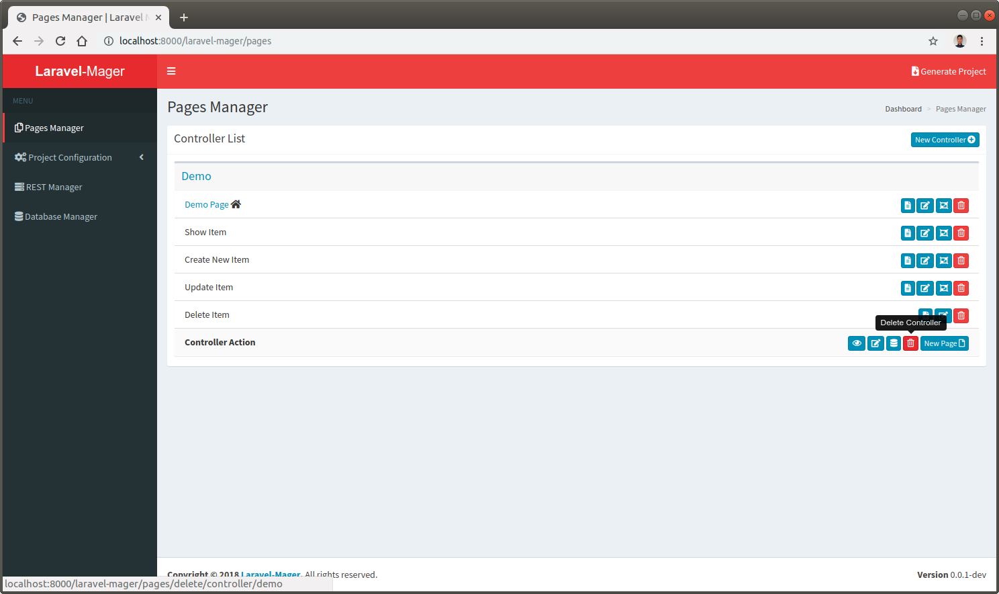

# Controller Management

## Create New Controller

### Click `new controller` button
 
 
### Fill the `create new` form
The example for create inventory controller with the following scenarios:

No. | Input | Example | Explaination
--- | --- | --- | ---
1. | **Page Name** | Inventory | The entity / object / feature that formed to be controller
2. | **Controller Name** | InventoryController | The controller class name
3. | **Controller Namespace** | App\Http\Controller | The controller namespace
4. | **Base Route URL** | inventory | The URL / link to access the controller using browser / REST API
5. | **Model Name** | Inventory | The model class for the controller
6. | **Web Controller** | checked | Controller availability to be accessed via web browser
7. | **REST Controller** | checked | Controller availability to be accessed via REST API

 

## Edit Existing Controller

### Click `Edit Controller Properties` Button

 

### Edit The Controller Properties

After the `Edit Controller Properties` button clicked, Edit Controller form will appeared. Edit form inputs are similar with Create New form inputs.

## Delete Controller

Use `Delete Controller` button to delete the controller properties.

 
